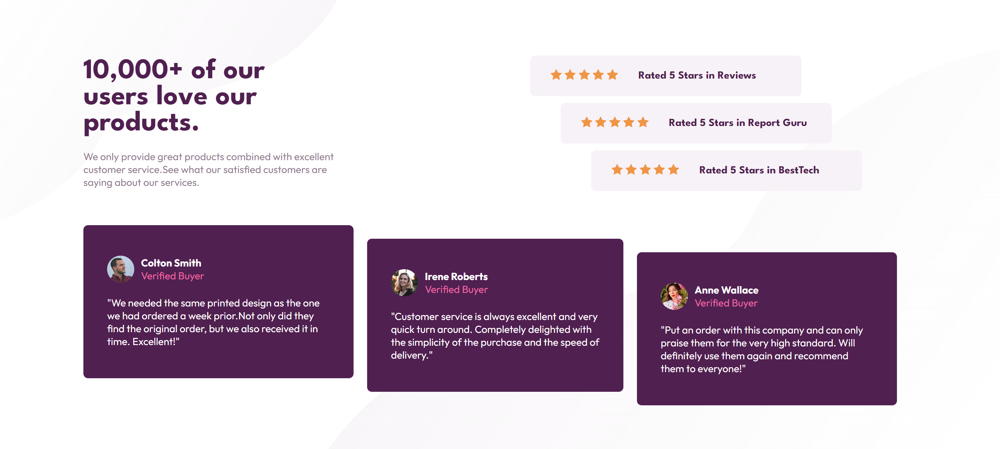

# Social proof section solution

This is a solution to the [Social proof section challenge on Frontend Mentor](https://www.frontendmentor.io/challenges/social-proof-section-6e0qTv_bA). 

## Table of contents

- [Overview](#overview)
  - [The challenge](#the-challenge)
  - [Screenshot](#screenshot)
  - [Links](#links)
- [My process](#my-process)
  - [Built with](#built-with)
  - [What I learned](#what-i-learned)
  - [Problems I faced](#problems-I-faced)
  - [Continued development](#continued-development)
  - [Useful resources](#useful-resources)
- [Author](#author)
- [Acknowledgments](#acknowledgments)

## Overview

### The challenge

Users should be able to:

- View the optimal layout for the section depending on their device's screen size

### Screenshot



### Links

- Solution URL: [Add solution URL here](https://your-solution-url.com)
- Live Site URL: [Add live site URL here](https://your-live-site-url.com)

## My process

### Built with

- Semantic HTML5 markup
- CSS custom properties
- Flexbox
- CSS Grid
- Mobile-first workflow

### What I learned

- How to set the width and heitht of body element to 100% of the screen:

```css

html,
body {
    width: 100%;
    height: 100%;
}
```
- How to set maltiple backgrounds:
```css
main {
   background-image: url('images/bg-pattern-top-mobile.svg'), url('images/bg-pattern-bottom-mobile.svg');
    background-repeat: no-repeat, no-repeat;
    background-position-y: top, bottom;
    background-position-x: left, right ;
}
```
- Use perdentage to set width in container elements instead of pixels.

### Problems I faced

- It was hard to set background images :
 - I used the above CSS code to set two background in the body element (mobile view) one in the top and the other in the bottom, but the height of the body element was less than the content (I do not understand why), its height equals the screen of the mobile), but when used the same properties inside the main element it worked.

### Continued development

- I should learn more about CSS and JavaScript and what is happenning under the hood.
- learn CSS preprocessors and js frameworks


## Author

- Linkedin - [Mostafa Karem](https://www.linkedin.com/in/mostafa-alfiky/)
- Frontend Mentor - [Mostafa Karem](https://www.frontendmentor.io/profile/Mostafa-Alfiky)

